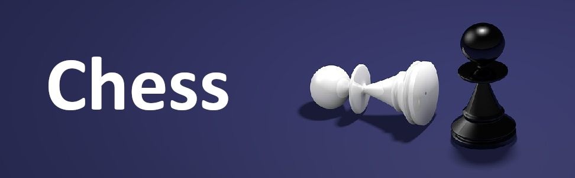

<h1 align="center">
  
</h1>

**- [Click here for English version.](README_EN.md)**
 
 

Simulador de ajedrez realizado con Unity.

A través de esta aplicación podrás jugar partidas contra la máquina o contra otro jugador (de forma local o a través de Internet).

¡Espero que lo disfrutes!

## Compilación del proyecto

El proyecto se ha creado utilizando la versión 2021.3.15f1 de Unity.

Simplemente clona el repositorio o copia los archivos contenidos en él y abre el proyecto con Unity. Los recursos necesarios se instalarán automáticamente.

Una vez dentro del editor de Unity, se podrá modificar y compilar el proyecto.

## Instrucciones del juego

Elige el modo de juego que quieras comienza automáticamente la partida.

En el modo multijugador, el jugador que crea la partida comenzará jugando con las blancas. Al crear la sala, se le dará un código de tres dígitos que deberá introducir el segundo jugador para poder unirse a la partida (jugando con las negras).

## Descarga del juego

Actualmente, esta versión del juego puede descargarse de los siguientes sitios.

<a href="https://sergiomejias.itch.io/chess">
<a href="https://gamejolt.com/games/chess/742413">
<a href="https://play.google.com/store/apps/details?id=com.SergioMejias.Chess">
<a href="https://galaxy.store/chess5">