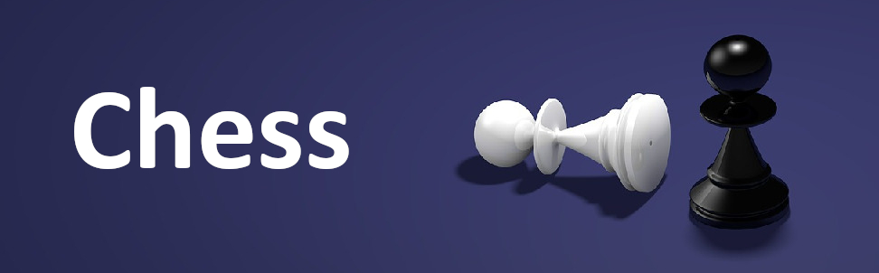

<h1 align="center">
  
</h1>

**- [Pulsa aquí para la versión en español.](README.md)**
 
 

Chess simulator made with Unity Engine.

Through this application you can play games against the machine or against another player (locally or through the Internet).

I hope you enjoy it!

## Project build

The project is created using Unity 2021.3.15f1.

Just clone the repository or copy the files contained in it and open the project with Unity. The necessary resources will be installed automatically.

Once inside the Unity editor, the project can be modified and compiled.

## Game instructions

Choose the game mode you want to automatically start the game.

In multiplayer mode, the player who creates the game will start with the white pieces. When creating the room, you will be given a three-digit code that the second player must enter in order to join the game (playing with the black pieces).

## Game download

Currently, this version of the application can be downloaded from the following sites.

<a href="https://sergiomejias.itch.io/chess">
<a href="https://gamejolt.com/games/chess/742413">
<a href="https://play.google.com/store/apps/details?id=com.SergioMejias.Chess">
<a href="https://galaxy.store/chess5">